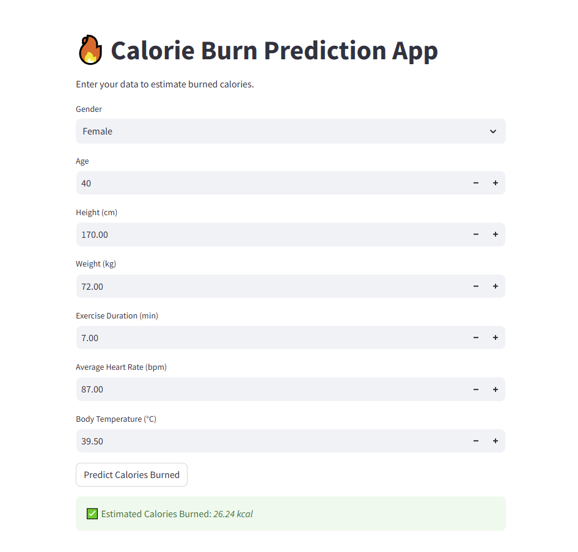
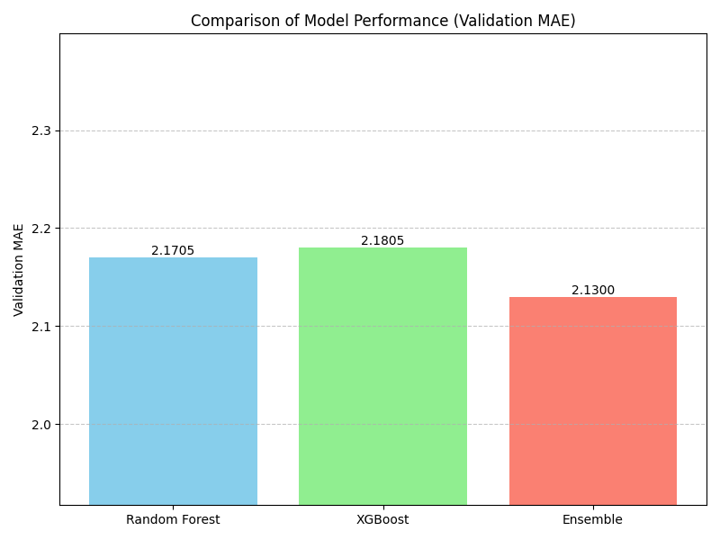
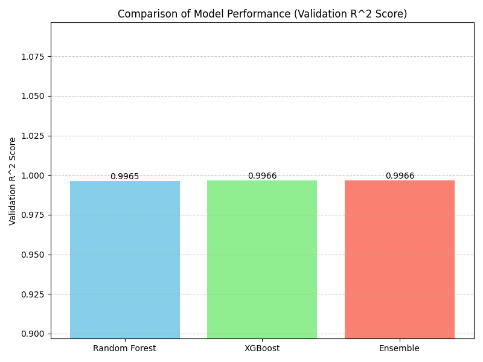
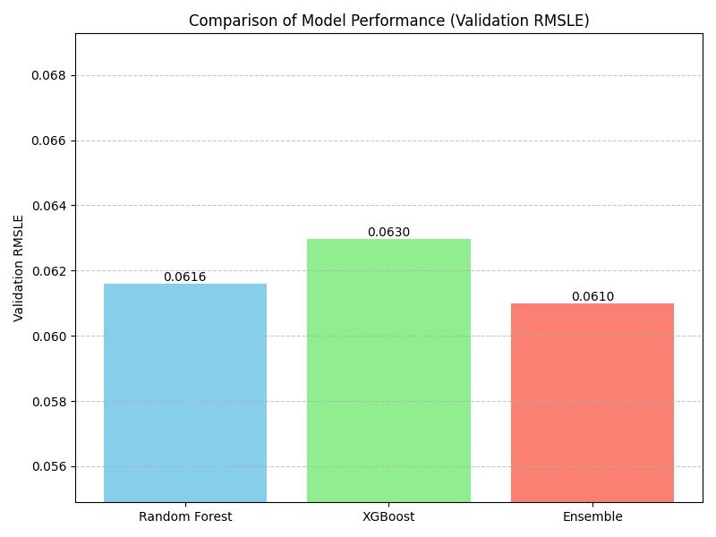

# 🔥 Calorie Prediction Model (Ensemble-Based)

[](https://calorie-predictor-67ao.onrender.com/)
[](LICENSE)

This project predicts the number of calories burned during physical activities using ensemble machine learning models based on user inputs like age, weight, height, duration, and heart rate. It includes advanced feature engineering and is deployed using Streamlit on Render.

---

## 🖼️ App Preview



🔗 **Also available on Streamlit Cloud**: [Click here to try it instantly](https://calorie-prediction-model-currhvtnfjrnwulqmgluuj.streamlit.app/)
---

## 📌 Project Overview

- **Goal**: Predict daily calorie burn from physiological and exercise data
- **Input Features**: Age, Height, Weight, Duration, Heart Rate, Body Temp, Gender
- **Techniques**: Ensemble learning, BMI and ACSM-based feature engineering
- **Deployment**: Hosted on Render using Streamlit

---

## 🧠 Feature Engineering

- **BMI (Body Mass Index)**  
  ```python
  BMI = Weight / (Height/100)**2
  ```

- **ACSM Calorie Estimation**  
  Based on formulas provided by the American College of Sports Medicine:
  ```python
  if Sex == 1:
      Calories = ((-55.0969 + (0.6309 * HR) + (0.1988 * Weight) + (0.2017 * Age)) / 4.184) * Duration
  else:
      Calories = ((-20.4022 + (0.4472 * HR) - (0.1263 * Weight) + (0.074 * Age)) / 4.184) * Duration
  ```

These features improved model interpretability and accuracy.

---

## 📊 Model Performance

### ✅ Validation Metrics

| Model          | MAE    | RMSLE   | R² Score |
|----------------|--------|---------|----------|
| Random Forest  | 2.1705 | 0.0616  | 0.9965   |
| XGBoost        | 2.1805 | 0.0630  | 0.9966   |
| Ensemble       | 2.1300 | 0.0610  | 0.9966   |

### 📈 Performance Graphs

**Mean Absolute Error (MAE):**  


**R² Score:**  


**Root Mean Squared Log Error (RMSLE):**  


---

## 📂 Project Structure

```
Calorie-Prediction-Model/
├── app.py                         # Streamlit app
├── model/
│   ├── rf_model.joblib            # Random Forest model
│   └── xgb_model.joblib           # XGBoost model
├── Calorie_Prediction_Model_ensemble_(V2).ipynb
├── requirements.txt
├── README.md
├── img/
│   ├── Calorie_predictor.png          # UI screenshot
│   └── model_comparison_mae.png       # MAE plot
│   └── model_comparison_r2.png        # R2 score plot
│   └── model_comparison_rmsle.png     # RMSLE plot

---

## 🚀 Run Locally

```bash
git clone https://github.com/9mithun9/Calorie-Prediction-Model.git
cd Calorie-Prediction-Model
pip install -r requirements.txt
streamlit run app.py
```

---

## 🎯 Output

> 🔥 **Estimated Calories Burned**

---

## 📜 License

Licensed under the MIT License.

---

Made with ❤️ by [Mithun Marshal](https://github.com/9mithun9)
